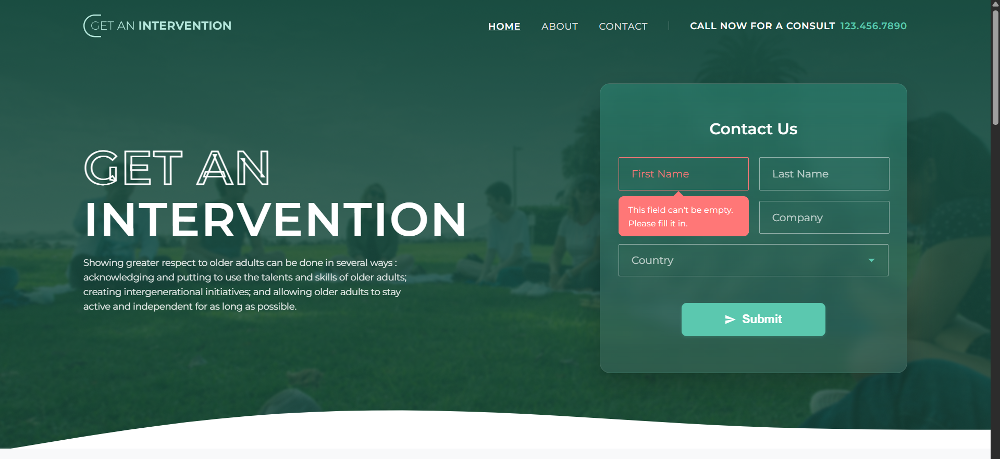
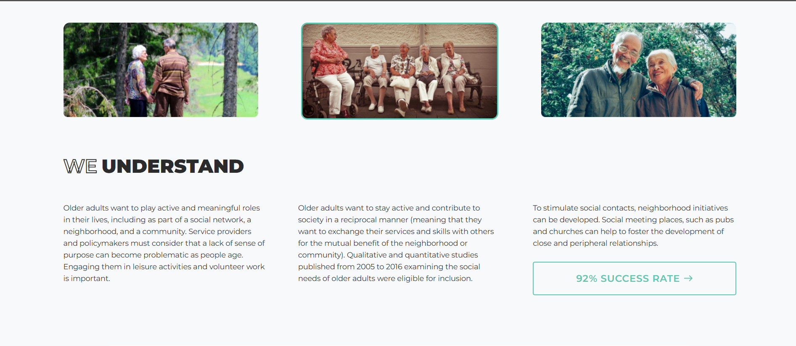
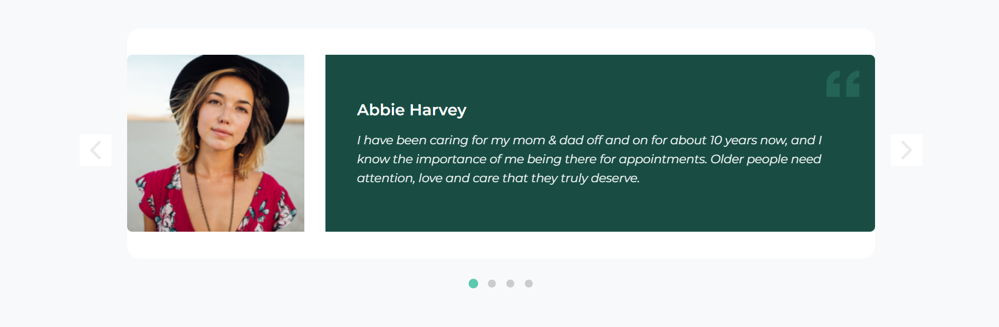
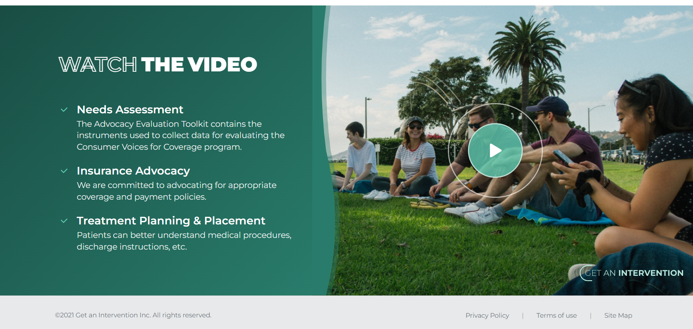
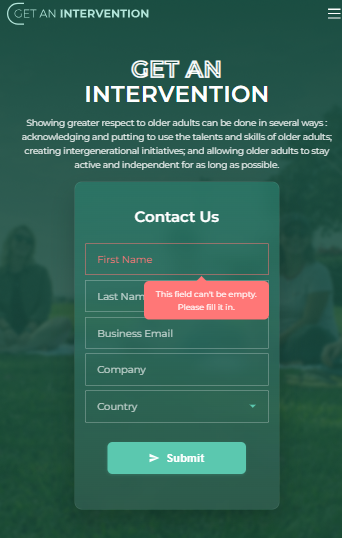
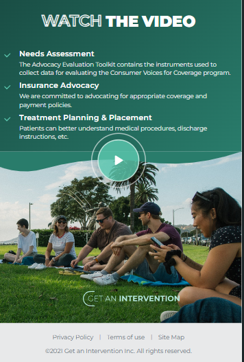

# Get an Intervention - Healthcare Services Website

A modern, responsive healthcare website for intervention services featuring a clean design, smooth animations, and comprehensive service information.

## 🌟 Features

- **Responsive Design** - Optimized for desktop, tablet, and mobile devices
- **Modern UI/UX** - Clean, professional design with smooth animations
- **Accessibility Ready** - WCAG compliant with proper ARIA labels and keyboard navigation
- **Performance Optimized** - Fast loading with optimized images and CSS
- **Cross-browser Compatible** - Works seamlessly across all modern browsers

## 📱 Screenshots

### Desktop Version





### Mobile Version



*Mobile-optimized layouts with touch-friendly navigation*

## 🛠️ Technologies Used

- **HTML5** - Semantic markup structure
- **CSS3** - Modern styling with Flexbox and Grid
- **JavaScript (ES6+)** - Interactive components and form handling
- **Inter Font Family** - Professional typography
- **SVG Icons** - Scalable vector graphics for crisp visuals

## 📁 Project Structure

```
get-an-intervention/
├── index.html                 # Main homepage
├── thank-you.html             # Thank you page after form submission
├── css/                       # All CSS-related files
├── js/
│   ├── components/            # All components related files
│   └── app.js                 # Main JS file
├── assets/
│   ├── images/                # Images files
│   ├── icons/                 # Icons files
│   └── screenshots/           # Screenshots for documentation
└── README.md
```

## 🎨 Design System

### Color Palette
```css
--primary-green: #5bc8af     /* Primary brand color */
--secondary-green: #7bd8c4   /* Secondary accent color */
--dark-green: #4db89a        /* Darker variant for hover states */
--text-dark: #2c3e50         /* Primary text color */
--text-light: #718096        /* Secondary text color */
```

### Typography
- **Primary Font**: Inter (Google Fonts)
- **Weights**: 400 (Normal), 500 (Medium), 600 (Semibold), 700 (Bold)
- **Fallback**: -apple-system, BlinkMacSystemFont, 'Segoe UI', Roboto

## 🚀 Getting Started

1. **Clone the repository**
   ```bash
   git clone https://github.com/albarkahdev/intervention-profile
   cd get-an-intervention
   ```

2. **Open in your preferred editor**
   ```bash
   code .  # VS Code
   # or open index.html in any text editor
   ```

3. **Launch the website**
   - Open `index.html` in your web browser
   - Or use a local server for development:
   ```bash
   # Python 3
   python -m http.server 8000
   
   # Node.js (if you have http-server installed)
   npx http-server
   ```

4. **View the website**
   - Navigate to `http://localhost:8000` (if using local server)
   - Or simply open `index.html` directly in browser

## 📱 Responsive Breakpoints

- **Desktop**: 1025px and above
- **Tablet**: 769px - 1024px
- **Mobile**: 768px and below
- **Small Mobile**: 480px and below

## ✨ Key Components

### 1. Hero Section
- Eye-catching background with overlay
- Clear call-to-action buttons
- Responsive typography scaling

### 2. Services Grid
- 3-column layout on desktop
- Stacked cards on mobile
- Hover effects with smooth transitions

### 3. Video Section
- Modal video player
- Custom play button with pulse animation
- Curved wave divider design

### 4. Contact Form
- Real-time validation
- Professional styling
- Success/error state handling

### 5. Navigation
- Sticky header on scroll
- Mobile hamburger menu
- Smooth scroll to sections

## 🎯 Browser Support

- Chrome 90+
- Firefox 88+
- Safari 14+
- Edge 90+
- Mobile browsers (iOS Safari, Chrome Mobile)

## 📄 Pages

- **Homepage** (`index.html`) - Main landing page with all sections
- **Thank You** (`thank-you.html`) - Confirmation page after form submission

## 🔧 Customization

### Adding New Sections
1. Create HTML structure in `index.html`
2. Add corresponding CSS file in `css/components/`
3. Include any JavaScript functionality in `js/components/`

## 🤝 Contributing

1. Fork the repository
2. Create a feature branch (`git checkout -b feature/new-feature`)
3. Commit your changes (`git commit -am 'Add new feature'`)
4. Push to the branch (`git push origin feature/new-feature`)
5. Create a Pull Request

## 🏆 Acknowledgments

- Design inspiration from modern healthcare websites
- Icons from Heroicons and custom SVG designs
- Font from Google Fonts (Inter)
- Photography from [Unsplash](https://unsplash.com)

---

**Built with ❤️ for better healthcare accessibility**
